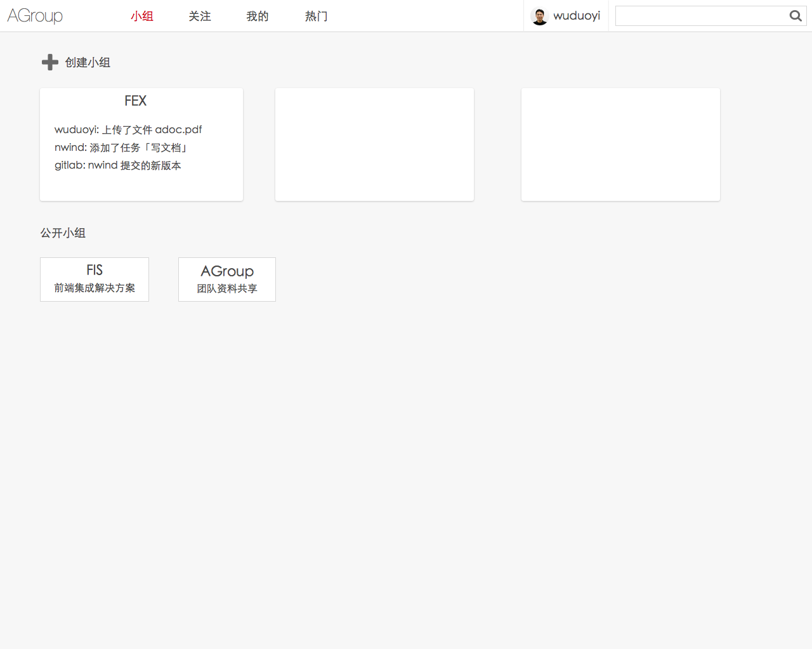
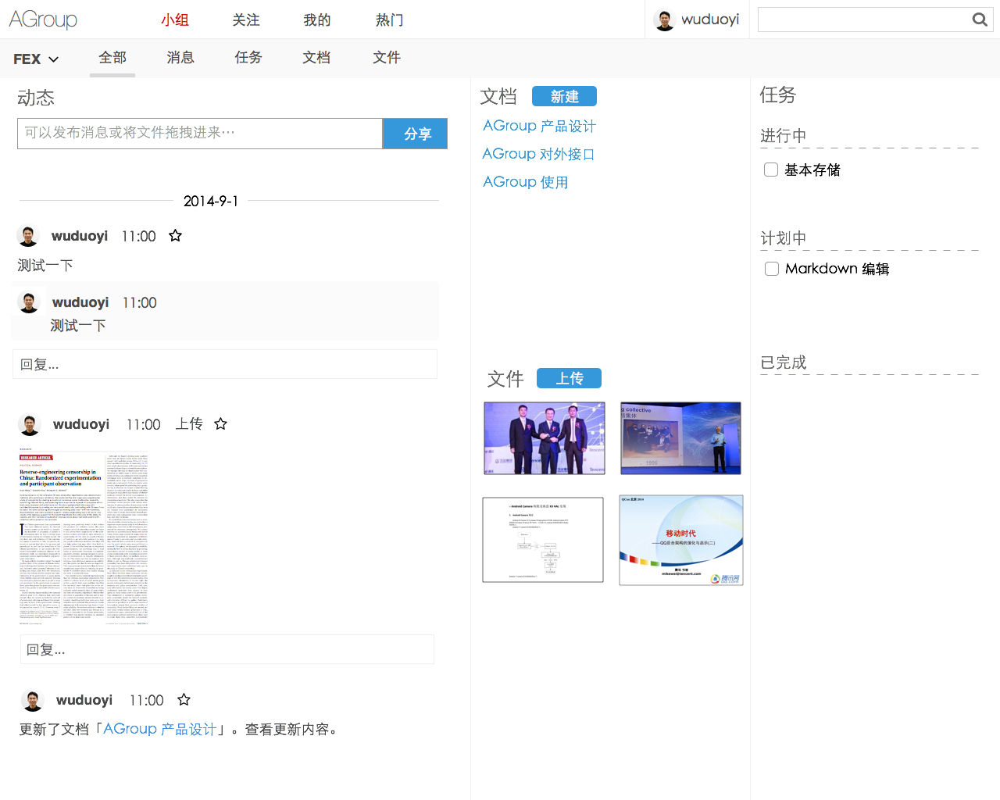
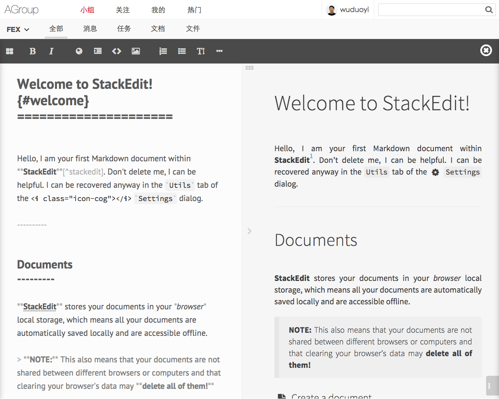

AGroup 的产品设计
---------------------------

## 出发点

随着团队和公司的变大，信息流通变得越来越难

* 如何让团队内部成员都了解各个项目的进展？
* 新人如何了解团队之前做过的事情？
* 如何知道公司其它团队在做什么？

## 现有产品的问题

具体相关产品的调研请阅读[这篇文档](competitor.md)，但它们有以下几个主要问题：

* 基于「团队」而不是「项目」，项目管理其实通过 gitlab 就行了，AGroup 的目标是取代邮件组，作为团队内部信息共享工具
* 信息放在公网上，安全性无法得到保证，对于中大型的公司是不可接受的，我们没法使用
* 主要解决的问题是团队内部共享，缺乏团队间的共享
* 国外因为缺乏 QQ 群，所以这些相关工具都是为了解决群聊的问题，在产品设计上偏向沟通

## AGroup 会有哪些不同？

AGroup 针对内部的特点，将提供以下几个不同的思路：

* 提供的是工具而不是外网服务，它将部署在内网机器上
* 提供一个聚合页面，在这里将大量相关信息都聚合起来，通过时间轴的方式展现
* 整合外部信息，比如内部 gitlab 提交后会发一个消息到动态中，这样团队中的所有相关信息都能在一个 timeline 上显示了
* 具备「热门」页面，可以通过它了解公司内其它小组在做的事情
* 采用扁平化的文件管理方式，通过强大的即时检索和预览功能来快速查找，避免 wiki 等层级太深导致难以查找相关资料的问题
* 具备长文档编辑能力，将提供多文档聚合、分段编辑、本地编辑等功能
* 用户体验优于后端性能，因为是内网服务，所以 AGroup 完全不用考虑后端性能，为了用户体验，它会实现很多耗性能的功能，如 pdf 快速预览、实时协同编辑等

## AGroup 的目标用户是谁？解决他们的什么问题？

大公司内的各个小团队，解决他们的信息流通及共享问题，同时方便跨团队信息共享

## AGroup 的核心功能

* 文档编辑和检索
* 团队信息聚合

## 产出形式

目前设计了几个页面的草图（设计还待确定）：

团队列表页，可以在这个页面创建团队和进入某个团队：

团队首页，这里可以看到当前团队成员所发的动态，了解现有团队任务和文档

文档编辑页

## 预计开发成本

目前先做具备基本功能的一期，开发时间不超过一个月，十一后内部试用，将 internal 的文档迁移过来，主要是验证想法，主要功能将有：

* 第一周
    * 基本存储的确定
    * API 设计
    * 项目创建
    * 文件上传
* 第二周
    * Markdown 在线编辑和保存
    * 任务创建和编辑
* 第三周
    * Markdown 图片拖拽上传
    * 简单协同编辑的支持

## 风险

* 如何能持续留住用户是关键，桌面工具、邮件提醒等功能必须尽早实现，否则很可能像大多数工具那样用一段时间就没人用了
* 在数据量增大前必须尽早实现检索功能，不然会陷入信息过多导致混乱的问题
* doc、ppt、excel 文档预览功能对很多团队来说是关键，必须尽早实现，不然就很难让别人使用
 
## 后续考虑

后续想象空间不错，可以做很多尝试，包括但不限于：

* Markdown 实时编辑
* 历史版本、文件删除与恢复
* HTML 富文本编辑
* 常见文档模板
* 邀请用户加入
* 通知系统
* 用户即时消息
* 图片预览
* 评论系统
* Tag 系统
* 任务系统
* 子任务
* 全文检索功能
* 每日邮件摘要
* 热门推荐
* @ 通知功能
* 我的动态、收藏等
* Word 预览
* PDF 预览、页数获取
* 多图浏览
* Excel 预览
* 文件过来与排序
* 表格编辑（CSV）
* URL 抓取和截图展现
* 管理员后台
* 团队日历
* 客户端版本（node-webkit）
* 图表编辑
* 创建投票
* 基于 WebRTC 的视频沟通
* 视频截图预览
* 接收邮件转发
* 项目进展图
* Babel 检索支持
* 团队功能定制、主题定制
* 截图 OCR
* 问答
* 内容推荐（PredictionIO）
