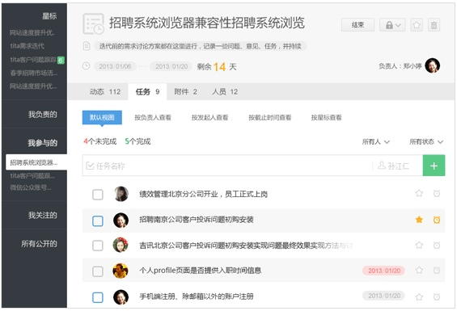

AGroup 类似产品的调研
-------------------------

## QQ 的群

在 QQ 群里可以进行资料共享，对于少量的信息和文件共享来说很方便

优点：

* 桌面客户端很普及
* 具备即时沟通讨论功能
* 图片和文件共享方便

缺点：

* 历史消息有限制，新人看不到以前的信息
* 文件共享不具备查找功能

## Wiki 类工具

这是很多公司内部使用的文档工具，比如 Twiki 等

优点：

* wiki 的编辑比较方便（相对于 word）
* 链接功能可以让很多文档聚合起来

缺点：

* wiki 语法各自不同，比 markdown 有更多的学习成本，比如写法千奇百怪的子标题写法
* 层级会造成文档查找的困难，变成一个个信息孤岛，不了解层次结构的新人很难找到相关资料
* 缺乏整体信息的跟踪，比如某个目录下最近更新了哪些文档

## ADoc

ADoc 是百度前端工程师常用的内部文档管理工具

优点：

* 本地编辑，通过简单的方法解决了各种文档的编辑和查看问题，比如 doc 的查看等
* 采用源码管理工具来管理版本，对工程师友好
* 定制化功能强大，很多产品线文档主页都是基于它二次开发的

缺点：

* 对于小修改来说太麻烦了
* 对非工程师不友好

## gitlab

gitlab 主要是用来管理项目的，但也可以用来进行内部资料分享，目前相当流行，可以在很大程度上取代 github 的私密项目功能

优点：源码管理功能很全面，具备 issues 管理等功能

缺点：

* 本身并不是针对文件共享而设计的，检索不方便，展现也不直观（比如不能预览 pdf 内容）
* 技术性太强，不适合非程序员使用，一时心情好想分享个文档，结果发现还得 git clone; git add; git push，直接没心情了

## Basecamp

Basecamp 是有 37signals 公司开发的，可以说是团队内部协作工具的始祖，国内的 tower.im 等工具都是抄它而来的，值得一提的是这个产品本身就是采用远程办公来开发的

Basecamp 是按照项目来划分的，主要有一下几个部分：

* 小论坛
* to do list，可以添加 todo 列表，并为每个 todo 列表添加 todo 项目
* 文件共享
* 文本文档

很多细节功能：

* 小论坛中的图片会以极小 icon 展现
* 如果评论为空就不显示
* 加 label 的小弹层
* 日历支持 ical 导出
* 文档截取部分内容展现

一个值得注意的是它的日历功能是独立于项目的，这样就能很方便地看到所有项目的日历

优点：

* 功能看起来刚刚好，而且日历功能很不错

缺点：

* 无法写复杂的文档，因为文档中不能插入图片，图片只能作为附件附在某篇文档后面，将图片当成了一种文件资源来管理

## tower.im

从界面到功能都是抄袭 Basecamp，但抄得很认真，有不少本地化功能，比如周报功能

## Campfire

类似 IM 中的群，每个人都可以发消息，发图片，发文件

优点：用起来简单、可以打电话，还有很多小细节做的不错

缺点：功能比较单一，文件多了不好管理，比起普通的群只多了文件管理功能，已经不再维护了，转向 Basecamp

## Kandan

和 Campfire 非常像，团队群与文件共享

优点：看起来表情功能还挺丰富的

缺点：功能简单

## Slack

这是新出的团队协作工具，刚出没多久就吸引了大量用户，它最大的特点是能整合其它服务，比如在 github 上有代码更新也会发一个消息提示，通过这种整合功能就

* 优点：集成化做得非常好，这点非常好，很值得借鉴

* 缺点：长文档编辑能力很弱

## Glip

它的 TODO 和 Calendar 日历可以在同一个输入框创建，使用起来非常方便，不过这意味着不能有 Todo List 了，因为只有一维，
整体来看和 slack 很像，不过没 slack 流行

优点：它的时间轴是反序的，最新的在前面，这点我比较喜欢

* 视频聊天功能
* 可以添加链接，这个链接会自动去抓取 title，页面图片等资源
* 可以通过邮件抄送的方式来将内容发到 Glip 上

## asana

目标是取代 email，专注做任务管理

优点：任务管理方面做得很细致，尤其是页面中还有快捷键提示

缺点：没有知识沉淀功能

另一个很像的产品是 eteams

## fengcheco

只有任务管理功能，不过正是因为专注，所以做得体验还不错

## unison.com

感觉就是群聊功能，没其他亮点

## Yammer

企业内部 SNS 协助工具，功能很像 Facebook、微博，基于人的信息聚合，居然被微软 12 亿美元买下了，是企业协作工具中目前做得最成功的

它的目标很远大，那就是打破部门隔阂，让所有人都能参与所有项目的讨论，如果能用好还挺有意思的

优点：

* 基于人的方式聚合，内部分享和传播变得很容易
* 有个点赞功能，你可以公开赞某人
* 可以关注人或小组

缺点：

* 感觉有点复杂
* 社交成分太多，或许老外用得比较习惯，感觉国内公司基本用不起来，不过还是挺有意思的

## tita.com

最初是打算抄 yammer 的，不过目前看起来并不是，但功能倒是挺多，比如邮件、日程管理等

## 明道

一个特色功能是可以邀请外部用户加入，也就是说他们能看到，这点还挺有意思

优点：

* 任务管理功能很强大，无限子分类
* 具备通讯录功能
* 开放平台，可扩展，比如会议室预定等功能

## Hall.com

感觉就像是个集成邮箱和 IM 功能的工具，和 Campfire 很像，不过界面要好些

缺点：和 Campfire 一样

## Gleasy.com

做成了个类似在线桌面的应用，功能还真多：IM、邮件、网盘、CRM、论坛、工作流⋯⋯

优点：

* 能解决大部分小公司的内部 OA 系统
* 可以在线编辑 word、excel、ppt http://www.gleasy.com/details-office.shtml

缺点：

* 感觉像「大公司」和政府公司的工具，功能多但每个都感觉有些粗糙，核心功能不突出

## teambition

它的任务管理功能很不错，可以方便看到现在所有任务的状态

还有回顾功能

优点：

* 界面设计很简洁
* 任务管理功能很强大，还可以自定义截断，类似
* 回顾和攻击功能还不错

## Evernote Business 版本

优点：

* 客户端很强大，用起来体验不错
* 检索很全面，还包括 OCR

缺点：不利于跨团队分享

## 公司 - Confluence

目前公司的 wiki 是基于 Confluence 改的

优点：功能非常多，比较有亮点的：

* @ 通知系统很全面
* 支持 PPT 的在线播放，看起来是通过转成图片来实现的
* 编辑功能很强，可以创建多栏页面
* 创建文章时有很多模板，比如「文件共享」、「会议纪要」、「操作列表等」

缺点：缺乏实时性，层次结构过深，导致操作复杂

## icafe

优点：功能非常多

缺点：项目中的 wiki、文档、讨论区等功能是各种拼凑出来的，使用起来麻烦